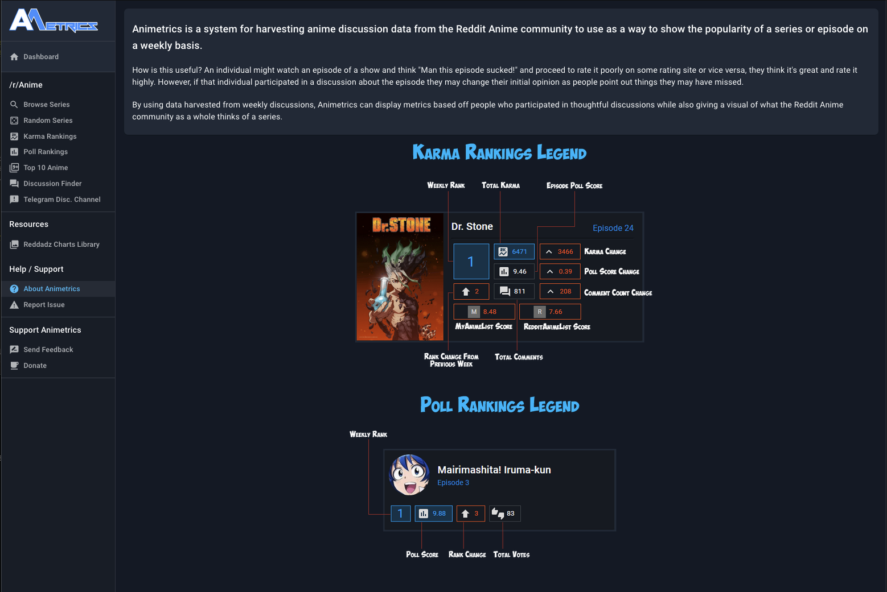
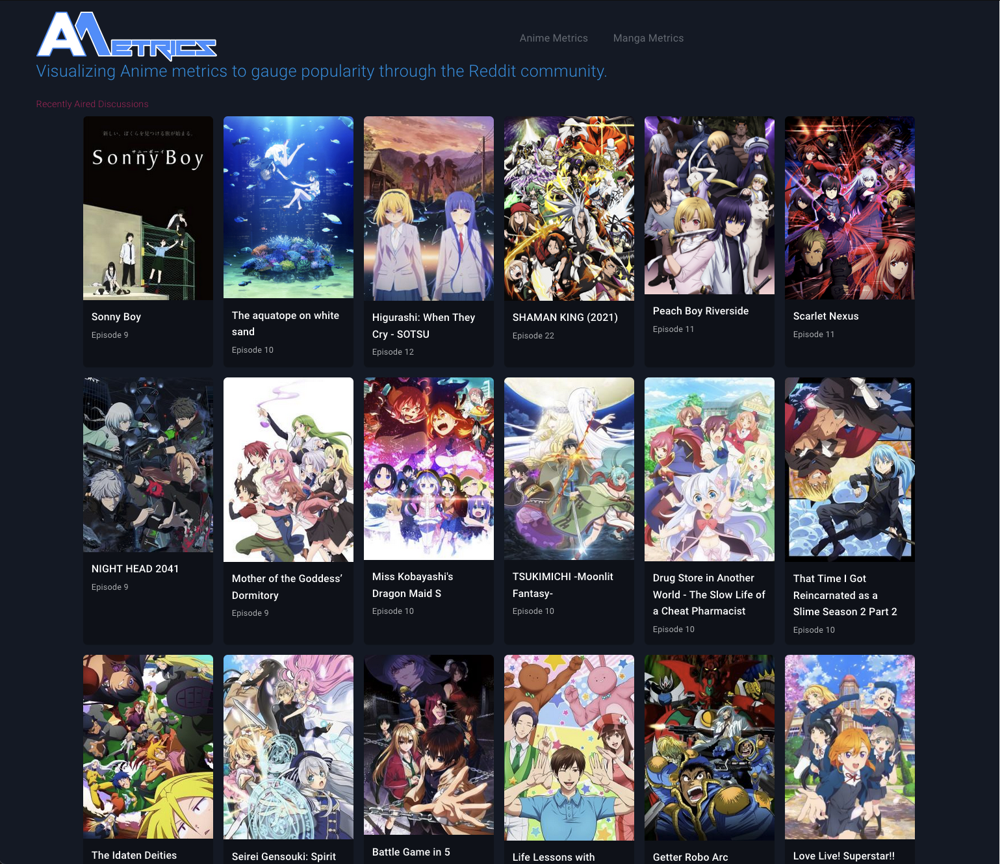
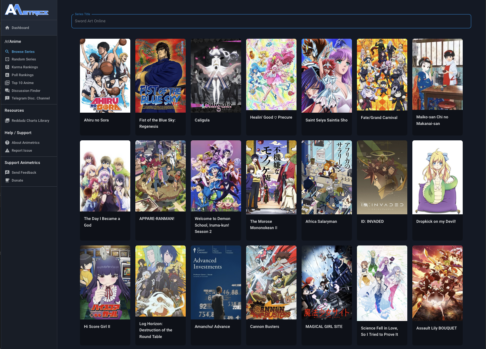
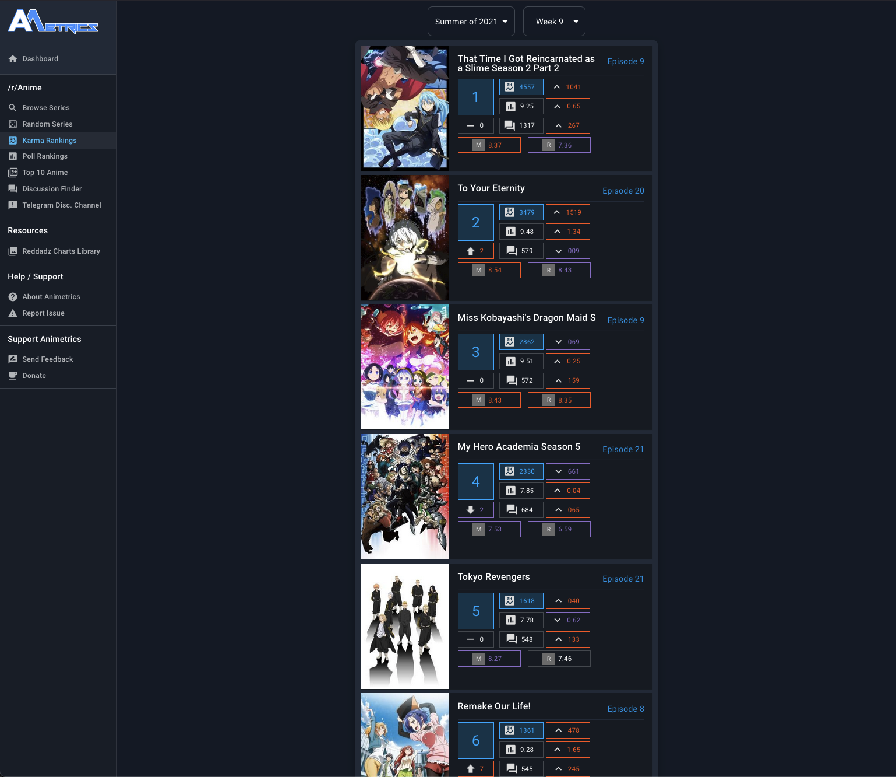
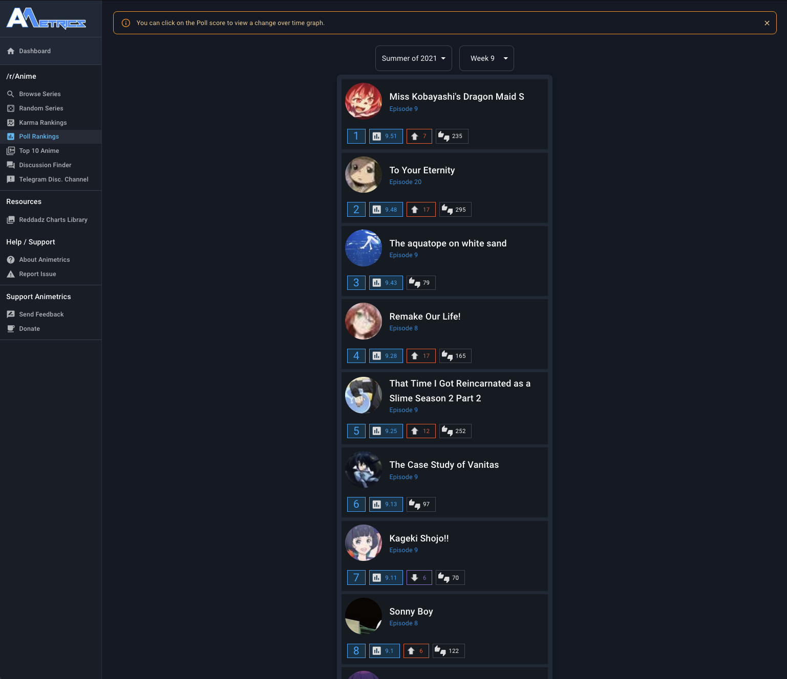
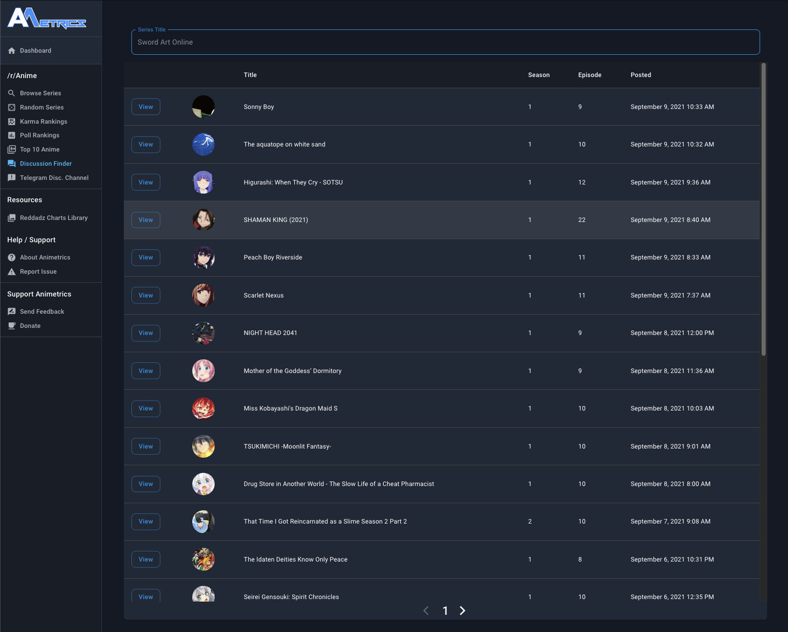
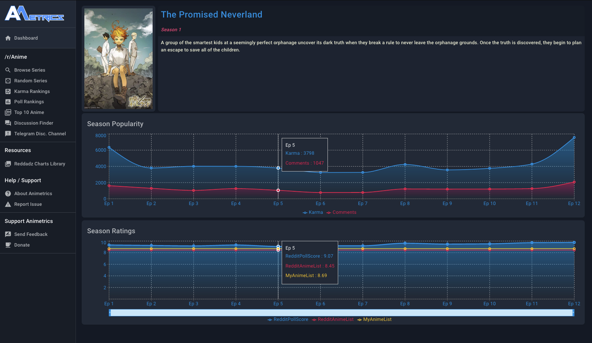

# Animetrics

Animetrics is a fully automated website that ranks currently airing anime series by their discussion data harvested from the /r/anime subreddit. It uses the Karma that discussions generate to rank anime on a weekly basis as well as scrapes pull results from those discussions.

Animetrics also provides a way to easily lookup past discussions through a search tool as well as the ability to look at the graphs of past series.

While the code was written fairly quick and I haven't had as much time as I would like since Covid started to really improve and add to the site it has managed to be fairly robust and rarely generated errors or issues. Not to say that won't change in the future. 

https://animetrics.co

_______

